# Silvermoat - Cloud Insurance Platform

**Silvermoat** is a production-ready, full-stack insurance platform built entirely on AWS serverless infrastructure. This repository provides a complete, deployable demonstration of a modern insurance system featuring quote management, policy administration, claims processing, payment handling, and AI-powered customer service.

The platform showcases enterprise-grade patterns including Infrastructure as Code with nested CloudFormation stacks, A-B deployment workflows for zero-downtime releases, comprehensive test automation, and seamless integration with Claude AI for intelligent customer interactions.

## Table of Contents

- [Overview](#overview)
- [Architecture](#architecture)
  - [High-Level Architecture](#high-level-architecture)
  - [Request Flow](#request-flow)
  - [AWS Services](#aws-services)
  - [CloudFormation Stack Hierarchy](#cloudformation-stack-hierarchy)
- [Development & Deployment](#development--deployment)
  - [CI/CD Pipeline](#cicd-pipeline)
  - [A-B Deployment Model](#a-b-deployment-model)
  - [Deployment Decision Flow](#deployment-decision-flow)
  - [Test Execution](#test-execution)
- [Data Layer](#data-layer)
  - [Database Schema](#database-schema)
  - [Document Upload Flow](#document-upload-flow)
  - [AI Chatbot Integration](#ai-chatbot-integration)
- [Frontend](#frontend)
  - [Component Architecture](#component-architecture)
  - [Data Management](#data-management)
  - [Application Routes](#application-routes)
- [Backend](#backend)
  - [API Handler Routing](#api-handler-routing)
- [Technology Stack](#technology-stack)
- [Project Structure](#project-structure)
- [Getting Started](#getting-started)
  - [Prerequisites](#prerequisites)
  - [Quick Start](#quick-start)
- [API Reference](#api-reference)
- [Development Guide](#development-guide)
- [Operations](#operations)
  - [Stack Deletion](#stack-deletion)
  - [Troubleshooting](#troubleshooting)
  - [Configuration](#configuration)
  - [Custom Domain Setup](#custom-domain-setup)
- [Important Notes](#important-notes)

## Overview

Silvermoat demonstrates a complete end-to-end insurance platform with the following capabilities:

- **Infrastructure as Code**: Complete CloudFormation templates for reproducible deployments
- **A-B Deployment Model**: Production (A) and ephemeral PR testing (B) stacks
- **Static Website Hosting**: S3 website hosting with CloudFront CDN
- **Serverless API**: API Gateway REST API proxying to Lambda functions
- **Data Storage**: DynamoDB tables for all domain entities (quotes, policies, claims, payments, cases, customers)
- **Document Management**: S3 bucket for secure document storage
- **AI Integration**: Claude-powered chatbot for intelligent customer service
- **Notifications**: SNS topic for event-driven notifications
- **Automated Cleanup**: Custom Resource Lambda for graceful stack teardown
- **Comprehensive Testing**: API contract tests, E2E browser tests, and smoke tests

## Architecture

### High-Level Architecture

This diagram shows the primary components and data flow within the Silvermoat platform. Users interact with a React single-page application served through CloudFront CDN, while API requests flow through API Gateway to Lambda functions that orchestrate interactions with DynamoDB, S3, SNS, and the Claude AI service.

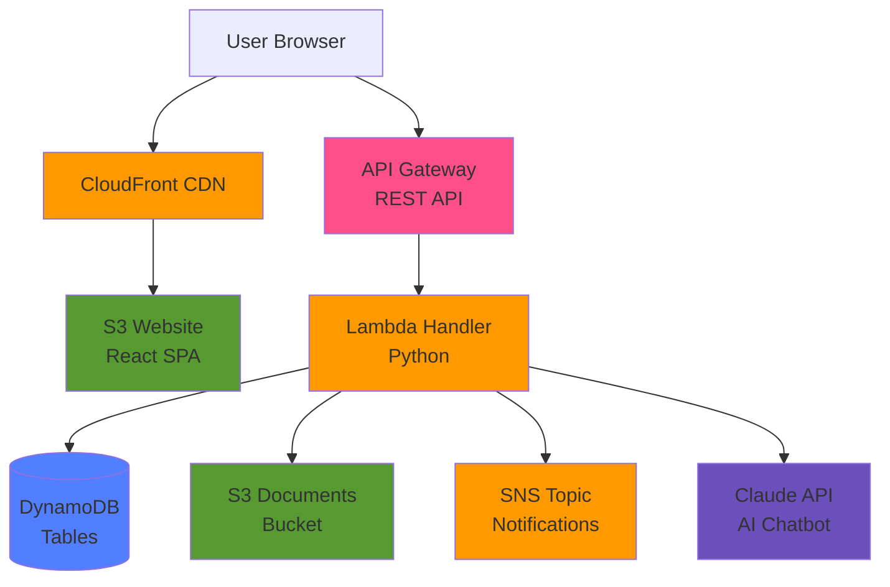

### Request Flow

This sequence diagram illustrates the three primary request flows: static asset delivery through CloudFront and S3, API requests for creating and managing insurance entities through API Gateway and DynamoDB, AI chatbot conversations that leverage customer context from DynamoDB with Claude AI, and document uploads that store files in S3 while maintaining references in DynamoDB.

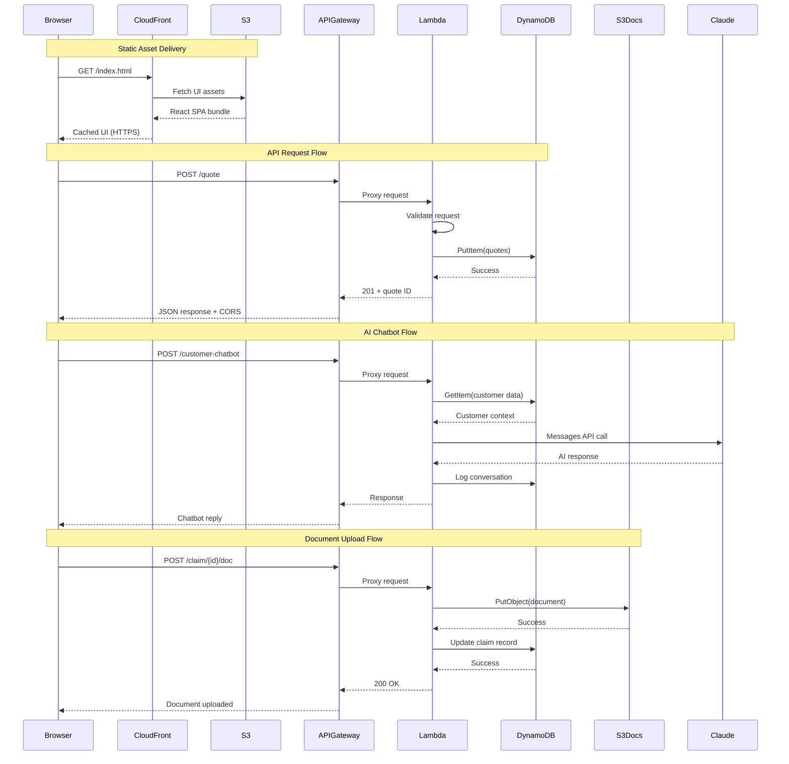

### AWS Services

This diagram details the complete AWS service architecture, showing how CloudFront serves the frontend with ACM certificates, API Gateway routes requests to Lambda functions, DynamoDB tables store domain data across seven entity types, S3 buckets manage documents and UI assets, SNS and EventBridge handle notifications and scheduled events, and IAM roles and policies secure the entire infrastructure.

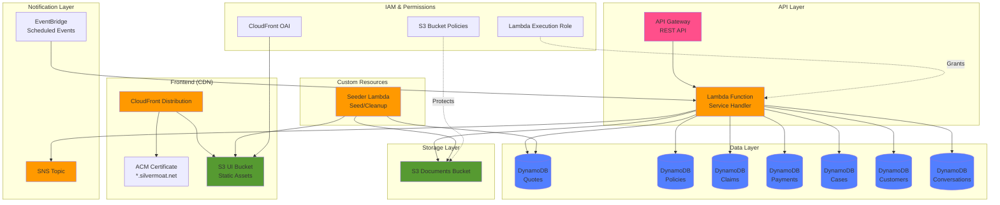

### AWS Architecture Diagram

Professional architecture diagram with official AWS icons, generated using the Python [diagrams](https://diagrams.mingrammer.com/) library:

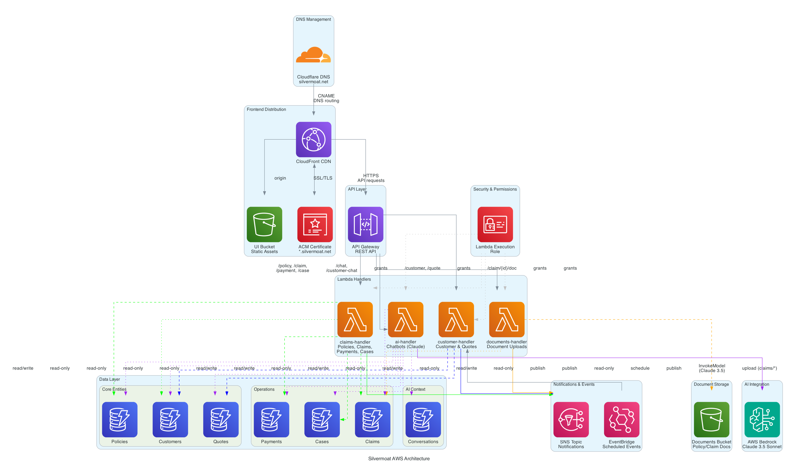

This diagram provides a visual representation of the complete infrastructure using standard AWS service icons. The diagram is generated programmatically from `scripts/generate-architecture-diagram.py` and can be regenerated on infrastructure changes:

```bash
pip install -r requirements-docs.txt
python scripts/generate-architecture-diagram.py
```

### Additional Documentation Diagrams

The platform includes comprehensive visual documentation covering data flow, entity relationships, user journeys, and deployment processes:

#### Data Flow Diagram

Shows how data moves through the system for key operations including quote creation, policy management, claim filing, and AI chatbot interactions:


#### Entity Relationship Diagram

Illustrates the data model with relationships and cardinality between core entities:


#### User Journey Map

Documents customer and agent workflows through the platform:


#### CI/CD Pipeline

Visualizes the complete deployment process from pull request to production:


All diagrams are generated at build time and automatically deployed with the application.

### CloudFormation Stack Hierarchy

This diagram shows the nested CloudFormation stack structure that organizes infrastructure into logical components. The parent stack orchestrates five nested stacks (Data, Storage, Compute, API, and Frontend) plus custom resources for seeding and cleanup, enabling modular infrastructure management and reusable templates.

```mermaid
graph TB
    Parent[Parent Stack<br/>silvermoat-mvp-s3-website.yaml]

    Parent --> Data[Data Stack<br/>data-stack.yaml]
    Parent --> Storage[Storage Stack<br/>storage-stack.yaml]
    Parent --> Compute[Compute Stack<br/>compute-stack.yaml]
    Parent --> API[API Stack<br/>api-stack.yaml]
    Parent --> Frontend[Frontend Stack<br/>frontend-stack.yaml]
    Parent --> Seeder[Custom Resources<br/>Parent Stack]

    Data --> DDB1[DynamoDB: Quotes]
    Data --> DDB2[DynamoDB: Policies]
    Data --> DDB3[DynamoDB: Claims]
    Data --> DDB4[DynamoDB: Payments]
    Data --> DDB5[DynamoDB: Cases]
    Data --> DDB6[DynamoDB: Customers]
    Data --> DDB7[DynamoDB: Conversations]
    Data --> SNS[SNS Topic]

    Storage --> S3UI[S3 UI Bucket]
    Storage --> S3Docs[S3 Docs Bucket]
    Storage --> BucketPolicies[Bucket Policies]

    Compute --> Lambda[Lambda: MvpServiceFunction]
    Compute --> LambdaRole[Lambda Execution Role]
    Compute --> Layer[Lambda Layer: Shared]

    API --> APIGW[API Gateway REST API]
    API --> Deployment[API Deployment]
    API --> Stage[API Stage]
    API --> Integration[Lambda Integration]

    Frontend --> CF[CloudFront Distribution]
    Frontend --> ACM[ACM Certificate]
    Frontend --> OAI[Origin Access Identity]

    Seeder --> SeederLambda[Seeder Lambda]
    Seeder --> CustomResource[Custom Resource Trigger]

    style Parent fill:#232F3E
    style Data fill:#527FFF
    style Storage fill:#569A31
    style Compute fill:#FF9900
    style API fill:#FF4F8B
    style Frontend fill:#FF9900
    style Seeder fill:#FF9900
```

## Development & Deployment

### CI/CD Pipeline

This diagram illustrates the complete CI/CD workflow from development through production deployment. Developers create feature branches and open pull requests, which trigger ephemeral test stack deployments with full test suites. Upon merge to main, the production stack is deployed with smart DNS updates, CloudFront cache invalidation, and smoke tests before going live.

```mermaid
graph LR
    subgraph "Developer Workflow"
        Dev[Developer] --> Branch[Feature Branch]
        Branch --> PR[Pull Request]
    end

    subgraph "PR Testing (B Stack)"
        PR --> GHA1[GitHub Actions<br/>pr-stack-deploy.yml]
        GHA1 --> Package1[Package Lambda]
        Package1 --> Deploy1[Deploy CFN Stack<br/>silvermoat-pr-123]
        Deploy1 --> Upload1[Upload UI to S3]
        Upload1 --> Tests1[Run Tests:<br/>API + E2E + Smoke]
        Tests1 -.->|PR Closed| Cleanup[pr-stack-cleanup.yml<br/>Delete Stack]
    end

    subgraph "Production (A Stack)"
        PR --> Merge[Merge to Main]
        Merge --> GHA2[GitHub Actions<br/>deploy-production.yml]
        GHA2 --> Package2[Package Lambda]
        Package2 --> Deploy2[Deploy CFN Stack<br/>silvermoat]
        Deploy2 --> DNS[Smart DNS Update<br/>Cloudflare]
        DNS --> Cache[Invalidate CloudFront<br/>Cache]
        Cache --> Upload2[Upload UI to S3]
        Upload2 --> Tests2[Run Smoke Tests]
        Tests2 --> Live[Live Production<br/>silvermoat.net]
    end

    style GHA1 fill:#2088FF
    style GHA2 fill:#2088FF
    style Tests1 fill:#22863A
    style Tests2 fill:#22863A
    style Live fill:#28A745
```

### A-B Deployment Model

This diagram compares the two deployment environments. B stacks are ephemeral, lightweight environments for PR testing that use HTTP-only S3 URLs, run comprehensive test suites, and are automatically cleaned up when PRs close. A stacks are persistent production environments with CloudFront CDN, custom HTTPS domains, smart DNS routing, and optimized smoke testing.

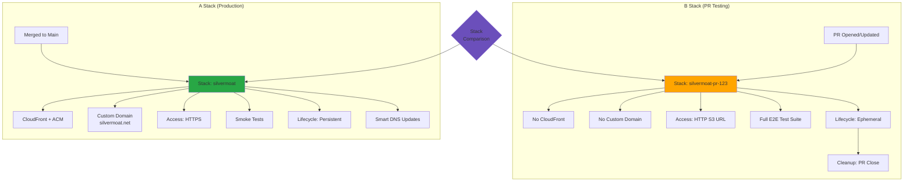

### Deployment Decision Flow

This diagram shows the automated decision tree for deployments based on code changes. Infrastructure changes trigger Lambda packaging and CloudFormation deployment with conditional DNS updates and cache invalidation. UI changes trigger React builds and S3 uploads. Test changes run the test suite without deployment, while documentation changes skip deployment entirely.

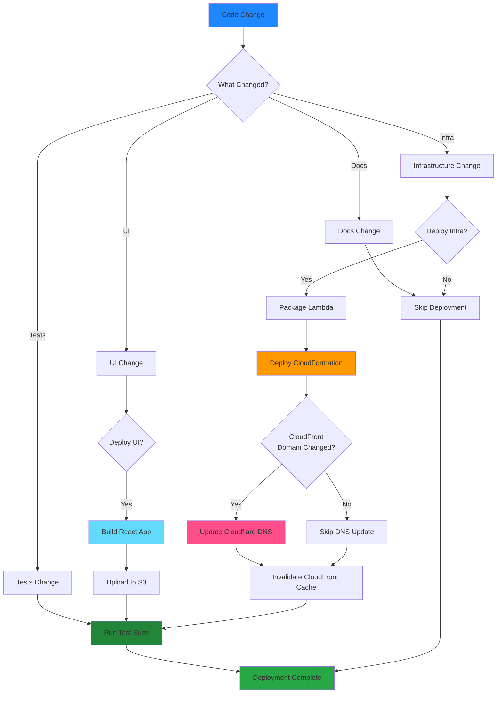

### Test Execution

This diagram shows the comprehensive test matrix executed during deployments. Tests flow sequentially from smoke tests (stack validation, outputs verification, URL reachability) through API contract tests (CRUD operations for all entities, security validation) to E2E browser tests (user workflows, navigation, forms, responsive design), followed by automated cleanup.

```mermaid
graph TB
    subgraph "Test Orchestration"
        Trigger[GitHub Actions Trigger]
        Deploy[Deploy Test Stack]
    end

    subgraph "Smoke Tests"
        S1[Stack Status Check]
        S2[Outputs Exist Check]
        S3[URL Reachability]
    end

    subgraph "API Contract Tests"
        A1[Quotes API]
        A2[Policies API]
        A3[Claims API]
        A4[Payments API]
        A5[Cases API]
        A6[Customers API]
        A7[Chatbot API]
        A8[Security Tests]
    end

    subgraph "E2E Browser Tests"
        E1[Landing Page]
        E2[Navigation]
        E3[Quote Creation]
        E4[Policy Workflow]
        E5[Claim Filing]
        E6[Payment Processing]
        E7[Customer Portal]
        E8[Responsive Design]
    end

    subgraph "Test Results"
        Results[Aggregate Results]
        Cleanup[Cleanup Test Stack]
    end

    Trigger --> Deploy
    Deploy --> S1
    S1 --> S2
    S2 --> S3

    S3 --> A1
    A1 --> A2
    A2 --> A3
    A3 --> A4
    A4 --> A5
    A5 --> A6
    A6 --> A7
    A7 --> A8

    A8 --> E1
    E1 --> E2
    E2 --> E3
    E3 --> E4
    E4 --> E5
    E5 --> E6
    E6 --> E7
    E7 --> E8

    E8 --> Results
    Results --> Cleanup

    style Trigger fill:#2088FF
    style S1 fill:#FFA500
    style S2 fill:#FFA500
    style S3 fill:#FFA500
    style A1 fill:#527FFF
    style A2 fill:#527FFF
    style A3 fill:#527FFF
    style A4 fill:#527FFF
    style A5 fill:#527FFF
    style A6 fill:#527FFF
    style A7 fill:#527FFF
    style A8 fill:#527FFF
    style E1 fill:#22863A
    style E2 fill:#22863A
    style E3 fill:#22863A
    style E4 fill:#22863A
    style E5 fill:#22863A
    style E6 fill:#22863A
    style E7 fill:#22863A
    style E8 fill:#22863A
    style Results fill:#28A745
    style Cleanup fill:#FF4F8B
```

## Data Layer

### Database Schema

This entity-relationship diagram shows the DynamoDB schema design with relationships between all domain entities. Customers create quotes that convert to policies, policies have claims and require payments, claims may escalate to cases, and all customer conversations are logged for the AI chatbot to maintain context across interactions.

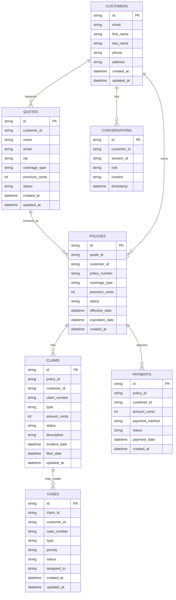

### Document Upload Flow

This sequence diagram details the document attachment workflow for claims. The Lambda handler validates the claim exists in DynamoDB, generates a unique document ID and S3 key, uploads the file to S3, updates the claim record with the document reference, publishes an SNS notification for downstream processing, and returns the document metadata to the browser.

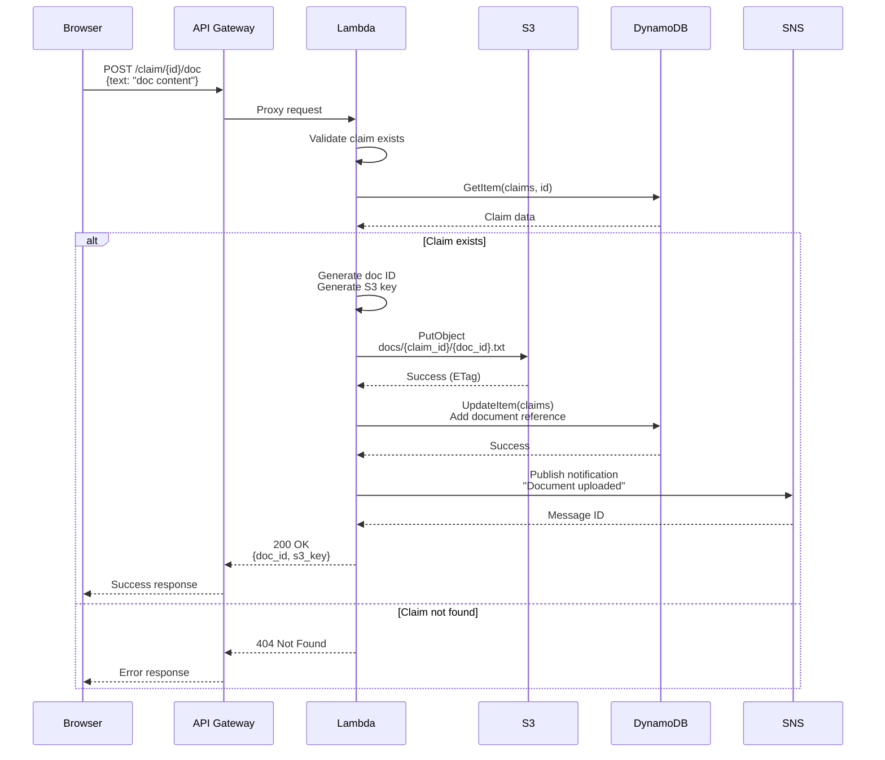

### AI Chatbot Integration

This sequence diagram shows both customer-facing and internal chatbot flows. The customer chatbot retrieves customer profiles, chat history, active policies, and recent claims from DynamoDB to build context before calling the Claude Messages API, then logs both user messages and assistant responses for conversation continuity. The internal chatbot provides data analysis for administrators by querying business data and using Claude to generate insights.

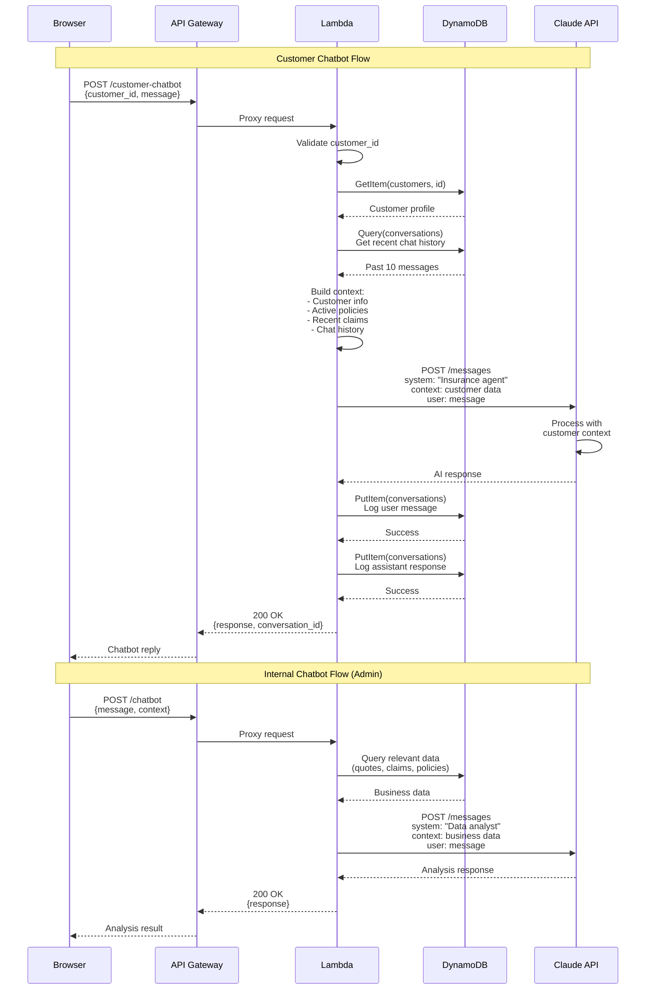

## Frontend

### Component Architecture

This diagram shows the React component hierarchy and organization. The App root provides QueryClientProvider and Router, which renders the AppLayout wrapper containing Header, Sidebar, and Breadcrumbs components alongside route-specific page components. Each domain module (Quotes, Policies, Claims, etc.) follows a consistent pattern with List, Table, Form, and Detail components, promoting code reusability and maintainability.

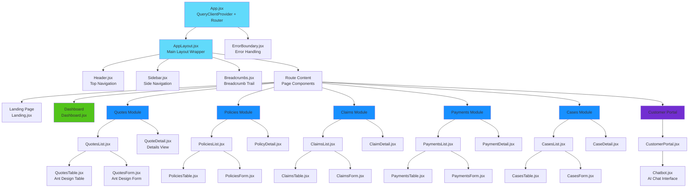

### Data Management

This sequence diagram illustrates React Query's caching and mutation patterns. Query flows show cache-first data access with automatic background refetching when data becomes stale, optimizing performance while maintaining data freshness. Mutation flows demonstrate how data updates trigger automatic cache invalidation and query refetching, ensuring the UI stays synchronized with backend state without manual cache management.

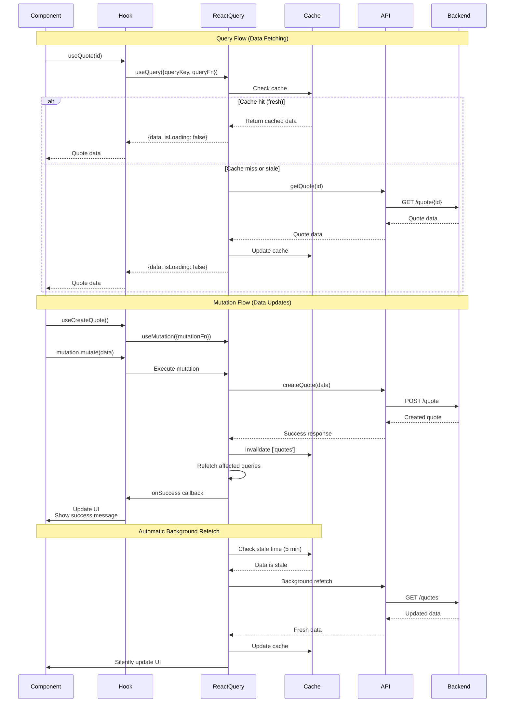

### Application Routes

This diagram shows the React Router structure with all application routes. The landing page serves as the entry point, followed by a dashboard overview and dedicated routes for each domain entity (quotes, policies, claims, payments, cases) with consistent list, create, and detail views. The customer portal provides a separate interface for end-users with AI chatbot access.

```mermaid
graph TB
    Router[React Router<br/>BrowserRouter]

    Router --> Root[/ Root]
    Root --> Landing[Landing Page]

    Router --> Dashboard[/dashboard]

    Router --> Quotes[/quotes]
    Quotes --> QuotesList[QuotesList]
    Quotes --> QuotesNew[/quotes/new<br/>QuotesList + Form]
    Quotes --> QuoteDetail[/quotes/:id<br/>QuoteDetail]

    Router --> Policies[/policies]
    Policies --> PoliciesList[PoliciesList]
    Policies --> PoliciesNew[/policies/new<br/>PoliciesList + Form]
    Policies --> PolicyDetail[/policies/:id<br/>PolicyDetail]

    Router --> Claims[/claims]
    Claims --> ClaimsList[ClaimsList]
    Claims --> ClaimsNew[/claims/new<br/>ClaimsList + Form]
    Claims --> ClaimDetail[/claims/:id<br/>ClaimDetail]

    Router --> Payments[/payments]
    Payments --> PaymentsList[PaymentsList]
    Payments --> PaymentsNew[/payments/new<br/>PaymentsList + Form]
    Payments --> PaymentDetail[/payments/:id<br/>PaymentDetail]

    Router --> Cases[/cases]
    Cases --> CasesList[CasesList]
    Cases --> CasesNew[/cases/new<br/>CasesList + Form]
    Cases --> CaseDetail[/cases/:id<br/>CaseDetail]

    Router --> Customer[/customer]
    Customer --> CustomerPortal[CustomerPortal.jsx]

    Router --> NotFound[* 404<br/>Not Found Page]

    style Router fill:#61DAFB
    style Landing fill:#52C41A
    style Dashboard fill:#52C41A
    style Quotes fill:#1890FF
    style Policies fill:#1890FF
    style Claims fill:#1890FF
    style Payments fill:#1890FF
    style Cases fill:#1890FF
    style Customer fill:#722ED1
    style NotFound fill:#FF4D4F
```

## Backend

### API Handler Routing

This diagram shows the Lambda function's request routing architecture. The API Gateway forwards all requests to the main handler.py entry point, which routes to specific handlers based on HTTP method and path. Each handler performs input validation, interacts with DynamoDB or S3, and returns standardized responses. Chatbot endpoints integrate with Claude API and log conversations for context continuity.

```mermaid
graph TB
    APIGW[API Gateway<br/>/{proxy+}]

    APIGW --> Lambda[handler.py<br/>Main Entry Point]

    Lambda --> Route{Route<br/>Request}

    Route -->|GET /| Root[Root Handler<br/>Health Check]
    Route -->|POST /quote| CreateQuote[Create Quote]
    Route -->|GET /quote/:id| GetQuote[Get Quote]
    Route -->|GET /quotes| ListQuotes[List Quotes]
    Route -->|POST /policy| CreatePolicy[Create Policy]
    Route -->|GET /policy/:id| GetPolicy[Get Policy]
    Route -->|GET /policies| ListPolicies[List Policies]
    Route -->|POST /claim| CreateClaim[Create Claim]
    Route -->|GET /claim/:id| GetClaim[Get Claim]
    Route -->|GET /claims| ListClaims[List Claims]
    Route -->|POST /claim/:id/status| UpdateClaimStatus[Update Claim Status]
    Route -->|POST /claim/:id/doc| AttachDocument[Attach Document]
    Route -->|POST /payment| CreatePayment[Create Payment]
    Route -->|GET /payment/:id| GetPayment[Get Payment]
    Route -->|GET /payments| ListPayments[List Payments]
    Route -->|POST /case| CreateCase[Create Case]
    Route -->|GET /case/:id| GetCase[Get Case]
    Route -->|GET /cases| ListCases[List Cases]
    Route -->|POST /customer| CreateCustomer[Create Customer]
    Route -->|GET /customer/:id| GetCustomer[Get Customer]
    Route -->|GET /customers| ListCustomers[List Customers]
    Route -->|POST /chatbot| InternalChatbot[Internal Chatbot<br/>chatbot.py]
    Route -->|POST /customer-chatbot| CustomerChatbot[Customer Chatbot<br/>customer_chatbot.py]

    CreateQuote --> Validate[Validate Input<br/>validators.py]
    CreateQuote --> DDB[DynamoDB Storage<br/>storage/dynamodb.py]
    CreateQuote --> Response[Format Response<br/>responses.py]

    AttachDocument --> S3[S3 Storage<br/>boto3 client]
    AttachDocument --> DDB
    AttachDocument --> SNS[SNS Notification<br/>events.py]

    InternalChatbot --> Claude1[Claude Messages API<br/>Anthropic SDK]
    CustomerChatbot --> Claude2[Claude Messages API<br/>Anthropic SDK]
    CustomerChatbot --> ConvLog[Log Conversation<br/>DynamoDB]

    Root --> Response
    GetQuote --> DDB
    GetQuote --> Response
    ListQuotes --> DDB
    ListQuotes --> Response

    style Lambda fill:#FF9900
    style Route fill:#FFD700
    style DDB fill:#527FFF
    style S3 fill:#569A31
    style Claude1 fill:#6B4FBB
    style Claude2 fill:#6B4FBB
    style Response fill:#52C41A
```

## Technology Stack

### Backend
- **Python 3.12**: Lambda runtime
- **boto3 1.35.90**: AWS SDK for Python
- **anthropic 0.43.1**: Claude AI SDK

### Frontend
- **React 19.2.3**: UI framework with functional components and hooks
- **React Router 7.11.0**: Client-side routing with lazy loading
- **React Query (TanStack Query) 5.90.15**: Server state management, caching, and mutations
- **Ant Design 6.1.3**: Enterprise-focused component library
- **Vite 7.3.0**: Fast build tool and dev server
- **dayjs 1.11.19**: Lightweight date library
- **Recharts 3.6.0**: Charting library for analytics

### Infrastructure
- **AWS CloudFormation**: Infrastructure as Code with nested stacks
- **AWS Lambda**: Serverless compute (Python 3.12)
- **API Gateway**: REST API management
- **DynamoDB**: NoSQL database (Pay-per-request billing)
- **S3**: Object storage (UI assets + documents)
- **CloudFront**: CDN for global content delivery
- **ACM**: SSL/TLS certificate management
- **SNS**: Pub/sub messaging
- **EventBridge**: Scheduled event triggers
- **IAM**: Identity and access management

### DevOps
- **GitHub Actions**: CI/CD automation
- **Cloudflare**: DNS management (API-driven)
- **pytest 8.3.4**: Python testing framework
- **Selenium 4.27.1**: Browser automation for E2E tests
- **Vitest 4.0.16**: JavaScript unit testing

## Project Structure

```
Silvermoat/
├── infra/
│   ├── silvermoat-mvp-s3-website.yaml    # Parent CloudFormation stack
│   └── nested/
│       ├── data-stack.yaml               # DynamoDB + SNS
│       ├── storage-stack.yaml            # S3 buckets + policies
│       ├── compute-stack.yaml            # Lambda functions + roles
│       ├── api-stack.yaml                # API Gateway + integration
│       └── frontend-stack.yaml           # CloudFront + ACM
├── lambda/
│   ├── mvp_service/
│   │   ├── handler.py                    # Main Lambda handler
│   │   ├── chatbot.py                    # Internal chatbot logic
│   │   └── customer_chatbot.py           # Customer chatbot logic
│   ├── layer/python/shared/
│   │   ├── responses.py                  # HTTP response helpers
│   │   ├── validators.py                 # Input validation
│   │   ├── events.py                     # SNS event publishing
│   │   └── storage/
│   │       ├── base.py                   # Storage interface
│   │       └── dynamodb.py               # DynamoDB implementation
│   └── seeder/
│       └── handler.py                    # Seeder/cleanup Lambda
├── ui/
│   ├── package.json                      # React/Vite dependencies
│   ├── vite.config.js                    # Vite build configuration
│   ├── index.html                        # HTML entry point
│   ├── src/
│   │   ├── main.jsx                      # React entry point
│   │   ├── App.jsx                       # Main app component with providers
│   │   ├── config/
│   │   │   ├── theme.js                  # Ant Design theme customization
│   │   │   ├── routes.jsx                # Route definitions with lazy loading
│   │   │   └── constants.js              # Application constants
│   │   ├── contexts/
│   │   │   └── AppContext.jsx            # Global UI state
│   │   ├── hooks/
│   │   │   ├── queries/                  # React Query hooks (data fetching)
│   │   │   └── mutations/                # React Query mutation hooks
│   │   ├── services/
│   │   │   ├── api.js                    # Generic API functions
│   │   │   ├── quotes.js                 # Quote-specific API
│   │   │   ├── policies.js               # Policy-specific API
│   │   │   ├── claims.js                 # Claim-specific API
│   │   │   ├── payments.js               # Payment-specific API
│   │   │   ├── cases.js                  # Case-specific API
│   │   │   └── customers.js              # Customer-specific API
│   │   ├── components/
│   │   │   ├── layout/
│   │   │   │   ├── AppLayout.jsx         # Main layout wrapper
│   │   │   │   ├── Header.jsx            # Top navigation
│   │   │   │   ├── Sidebar.jsx           # Left sidebar navigation
│   │   │   │   └── Breadcrumbs.jsx       # Breadcrumb navigation
│   │   │   └── common/
│   │   │       ├── StatusTag.jsx         # Status badges
│   │   │       ├── EmptyState.jsx        # Empty state component
│   │   │       ├── ErrorBoundary.jsx     # Error boundary
│   │   │       └── LoadingSpinner.jsx    # Loading component
│   │   ├── pages/
│   │   │   ├── Landing/                  # Landing page
│   │   │   ├── Dashboard/                # Dashboard page
│   │   │   ├── Quotes/                   # Quote management
│   │   │   ├── Policies/                 # Policy management
│   │   │   ├── Claims/                   # Claim management
│   │   │   ├── Payments/                 # Payment management
│   │   │   ├── Cases/                    # Case management
│   │   │   └── Customer/                 # Customer portal
│   │   └── utils/
│   │       ├── formatters.js             # Date, currency formatting
│   │       ├── seedData.js               # Demo data seeding utility
│   │       └── validators.js             # Custom validators
│   └── dist/                             # Build output (generated)
├── tests/
│   ├── api/                              # API contract tests (pytest)
│   │   ├── test_quotes.py
│   │   ├── test_policies.py
│   │   ├── test_claims.py
│   │   ├── test_payments.py
│   │   ├── test_cases.py
│   │   ├── test_customers.py
│   │   ├── test_chatbot.py
│   │   ├── test_customer_chatbot.py
│   │   └── test_security.py
│   ├── e2e/                              # E2E browser tests (Selenium)
│   │   ├── pages/                        # Page Object Models
│   │   └── tests/
│   └── smoke/                            # Deployment smoke tests
├── scripts/
│   ├── deploy-stack.sh                   # Deploy CloudFormation stack
│   ├── delete-stack.sh                   # Delete stack
│   ├── get-outputs.sh                    # Get stack outputs
│   ├── deploy-ui.sh                      # Build and deploy UI
│   ├── deploy-all.sh                     # Deploy infrastructure + UI
│   ├── redeploy-all.sh                   # Delete and redeploy everything
│   ├── package-lambda.sh                 # Package Lambda functions
│   ├── smoke-test.sh                     # Run smoke tests
│   └── update-cloudflare-dns.sh          # Smart DNS update script
├── .github/
│   └── workflows/
│       ├── deploy-production.yml         # A stack deployment (main branch)
│       ├── deploy-test.yml               # B stack deployment (PRs)
│       ├── test-suite.yml                # Full test suite runner
│       └── claude.yml                    # Claude AI integration
├── docs/
│   ├── github-setup.md                   # GitHub Actions setup guide
│   └── ab-deployment-design.md           # A-B deployment architecture
└── README.md                             # This file
```

## Getting Started

### Prerequisites

- **AWS CLI** configured with appropriate credentials
- **AWS Permissions** to create:
  - S3 buckets and policies
  - Lambda functions and IAM roles
  - API Gateway REST APIs
  - DynamoDB tables
  - SNS topics
  - CloudFront distributions
  - ACM certificates
  - EventBridge events
  - CloudFormation stacks
- **Node.js** 18+ for building the React app
- **npm** or **yarn** for package management
- **Python** 3.12+ for Lambda development and testing
- **jq** (optional, for JSON parsing in scripts)
- **Cloudflare Account** (optional, for custom domain setup)

### Quick Start

#### 1. Deploy Infrastructure

Deploy the CloudFormation stack:

```bash
./scripts/deploy-stack.sh
```

Or with custom parameters:

```bash
STACK_NAME=my-silvermoat \
APP_NAME=silvermoat \
STAGE_NAME=prod \
UI_SEEDING_MODE=external \
./scripts/deploy-stack.sh
```

**Parameters:**
- `STACK_NAME`: CloudFormation stack name (default: `silvermoat`)
- `APP_NAME`: Short app name for resource naming (default: `silvermoat`)
- `STAGE_NAME`: API Gateway stage name (default: `demo`)
- `API_DEPLOYMENT_TOKEN`: Token to force API redeployment (default: `v1`)
- `UI_SEEDING_MODE`: `seeded` (Lambda uploads simple HTML) or `external` (React SPA) (default: `external`)

Wait for `CREATE_COMPLETE` status.

#### 2. Get Stack Outputs

View stack outputs:

```bash
./scripts/get-outputs.sh
```

Key outputs:
- `WebUrl`: S3 website URL (HTTP)
- `ApiBaseUrl`: API Gateway base URL (HTTPS)
- `UiBucketName`: S3 bucket for UI assets
- `DocsBucketName`: S3 bucket for documents
- `CloudFrontUrl`: CloudFront distribution URL (HTTPS)

#### 3. Deploy UI

Build and deploy the React SPA:

```bash
./scripts/deploy-ui.sh
```

This will:
1. Install npm dependencies
2. Build the React app
3. Sync to S3 with proper cache headers
4. Display the website URL

#### 4. Verify Deployment

Run smoke tests:

```bash
./scripts/smoke-test.sh
```

Or manually test:
- Open the `CloudFrontUrl` in a browser
- Create a quote using the form
- Check API responses
- Try the customer chatbot

## API Reference

The API supports CRUD operations for all entities:

### Quotes
```bash
POST /quote              # Create quote
GET /quote/{id}          # Get quote
GET /quotes              # List all quotes
```

### Policies
```bash
POST /policy             # Create policy
GET /policy/{id}         # Get policy
GET /policies            # List all policies
```

### Claims
```bash
POST /claim              # Create claim
GET /claim/{id}          # Get claim
GET /claims              # List all claims
POST /claim/{id}/status  # Update claim status
POST /claim/{id}/doc     # Attach document to claim
```

### Payments
```bash
POST /payment            # Create payment
GET /payment/{id}        # Get payment
GET /payments            # List all payments
```

### Cases
```bash
POST /case               # Create case
GET /case/{id}           # Get case
GET /cases               # List all cases
```

### Customers
```bash
POST /customer           # Create customer
GET /customer/{id}       # Get customer
GET /customers           # List all customers
```

### Chatbots
```bash
POST /chatbot            # Internal chatbot (data analysis)
POST /customer-chatbot   # Customer-facing chatbot
```

## Development Guide

### Local UI Development

Start the Vite dev server:

```bash
cd ui
npm install
npm run dev
```

The UI will be available at `http://localhost:5173`.

**Note**: You'll need to configure the API base URL. Either:
1. Set `VITE_API_BASE_URL` environment variable
2. Or modify `ui/src/App.jsx` to use your deployed API URL

### Building UI

Build for production:

```bash
cd ui
npm run build
```

Output will be in `ui/dist/`.

### Running Tests

**API Contract Tests:**
```bash
cd tests/api
STACK_NAME=silvermoat pytest -v
```

**E2E Tests:**
```bash
cd tests/e2e
STACK_NAME=silvermoat pytest -v
```

**All Tests:**
```bash
pytest -v
```

## Operations

### Stack Deletion

Delete the entire stack:

```bash
./scripts/delete-stack.sh
```

**Important**: The stack includes automatic cleanup that:
- Empties both S3 buckets (including all versions and delete markers)
- Wipes all DynamoDB table items
- Ensures buckets are empty before CloudFormation attempts deletion

If deletion fails with "bucket not empty", check CloudWatch logs for the `SeederFunction` Lambda to see if cleanup completed successfully.

### Troubleshooting

#### Stack Creation Fails

**Issue**: Custom Resource fails during stack creation

**Solution**:
1. Check CloudWatch logs for `SeederFunction`:
   ```bash
   aws logs tail /aws/lambda/<stack-name>-SeederFunction-<id> --follow
   ```
2. Verify IAM permissions are correct
3. Check that all dependencies are created before the Custom Resource runs

#### UI Not Loading

**Issue**: CloudFront or S3 website returns 403 or 404

**Solution**:
1. Verify bucket policy allows CloudFront access
2. Check that `index.html` exists in the bucket:
   ```bash
   aws s3 ls s3://<ui-bucket-name>/
   ```
3. Ensure CloudFront distribution is fully deployed
4. Check CloudFront origin settings

#### API Returns CORS Errors

**Issue**: Browser shows CORS errors when calling API

**Solution**: The Lambda function includes CORS headers. If issues persist:
1. Check Lambda logs for errors
2. Verify API Gateway integration is `AWS_PROXY`
3. Ensure the request includes proper headers

#### Stack Deletion Stuck on Buckets

**Issue**: Stack deletion fails because buckets are not empty

**Solution**:
1. Check CloudWatch logs for `SeederFunction` cleanup execution
2. Verify the cleanup Lambda has permissions to delete objects
3. Manually empty buckets if needed (shouldn't be necessary):
   ```bash
   aws s3 rm s3://<bucket-name> --recursive
   ```

#### React App Can't Find API

**Issue**: UI shows "API base URL not configured"

**Solution**:
1. Ensure `deploy-ui.sh` sets `VITE_API_BASE_URL` during build
2. Or manually set it in `ui/src/App.jsx`
3. Or set `window.API_BASE_URL` in `ui/index.html` before the app loads

#### Chatbot Returns Errors

**Issue**: Chatbot API returns 500 errors

**Solution**:
1. Verify `ANTHROPIC_API_KEY` is set in Lambda environment variables
2. Check Lambda logs for Claude API errors
3. Ensure Lambda has internet access (via NAT Gateway if in VPC)
4. Verify Claude API quota/billing

### Configuration

#### Environment Variables

Scripts support the following environment variables:

- `STACK_NAME`: CloudFormation stack name (default: `silvermoat`)
- `APP_NAME`: App name for resource naming (default: `silvermoat`)
- `STAGE_NAME`: API Gateway stage (default: `demo`)
- `API_DEPLOYMENT_TOKEN`: API deployment token (default: `v1`)
- `UI_SEEDING_MODE`: UI seeding mode (default: `external`)
- `DOMAIN_NAME`: Custom domain for CloudFront (default: `silvermoat.net`)
- `CREATE_CLOUDFRONT`: Create CloudFront distribution (default: `true`)

#### CloudFormation Parameters

The template accepts these parameters:

- `AppName`: Short app name used in resource naming
- `StageName`: API Gateway stage name (must match `^[a-zA-Z0-9_-]+$`)
- `ApiDeploymentToken`: Change to force API Gateway redeployment
- `UiSeedingMode`: `seeded` (Lambda uploads HTML) or `external` (deploy separately)
- `DomainName`: Optional custom domain for CloudFront (e.g., `silvermoat.net`)
- `CreateCloudFront`: Create CloudFront distribution (`true` or `false`)
- `LambdaCodeS3Bucket`: S3 bucket containing Lambda deployment packages
- `MvpServiceCodeS3Key`: S3 key for MVP service Lambda package
- `SeederCodeS3Key`: S3 key for seeder Lambda package

### Custom Domain Setup

#### Quick Start (With Default Domain)

Deploy the stack normally - it will create ACM certificate for `silvermoat.net`:

```bash
./scripts/deploy-all.sh
```

**Important**: The stack will wait for ACM certificate validation. You must add the validation CNAME to Cloudflare or the deployment will fail after ~30 minutes.

#### Enable Custom Domain

##### Step 1: Deploy Stack

```bash
./scripts/deploy-all.sh
```

The stack uses `silvermoat.net` by default. To use a different domain:

```bash
DOMAIN_NAME=app.silvermoat.net ./scripts/deploy-stack.sh
```

To disable custom domain (CloudFront default only):

```bash
DOMAIN_NAME="" ./scripts/deploy-stack.sh
```

##### Step 2: Get DNS Validation Record

Stack creates ACM certificate and waits for DNS validation. Get the validation record:

```bash
aws acm describe-certificate \
  --certificate-arn $(aws cloudformation describe-stacks \
    --stack-name silvermoat \
    --query "Stacks[0].Outputs[?OutputKey=='CertificateArn'].OutputValue" \
    --output text) \
  --query "Certificate.DomainValidationOptions[0].ResourceRecord" \
  --output table
```

Or check ACM console: https://console.aws.amazon.com/acm/

You'll see a CNAME record like:
- **Name**: `_abc123def456.silvermoat.net`
- **Value**: `_xyz789.acm-validations.aws.`

##### Step 3: Add DNS Validation Record in Cloudflare

1. Log in to Cloudflare dashboard
2. Select your domain (`silvermoat.net`)
3. Go to **DNS** → **Records**
4. Click **Add record**
5. Configure:
   - **Type**: `CNAME`
   - **Name**: `_abc123def456` (the validation subdomain from Step 2)
   - **Target**: `_xyz789.acm-validations.aws.` (the validation target from Step 2)
   - **Proxy status**: **DNS only** (gray cloud icon, NOT orange)
   - **TTL**: Auto

**Wait 5-15 minutes** for validation to complete. The CloudFormation stack will proceed once validated.

##### Step 4: Add CloudFront Alias Record in Cloudflare

Once stack deployment completes, get the CloudFront domain:

```bash
./scripts/get-outputs.sh
# Look for "CloudFrontDomain" output
```

Add the alias CNAME in Cloudflare:

1. Go to **DNS** → **Records**
2. Click **Add record**
3. Configure:
   - **Type**: `CNAME`
   - **Name**: `@` (for apex domain) or subdomain like `app`
   - **Target**: `xyz123.cloudfront.net` (CloudFront domain from outputs)
   - **Proxy status**: **DNS only** (gray cloud icon, NOT orange)
   - **TTL**: Auto

**Important**: Cloudflare proxy must be **disabled** (DNS only, gray cloud) for CloudFront to work properly.

##### Step 5: Test

Visit your custom domain:
```
https://silvermoat.net
```

Should load Silvermoat UI with valid HTTPS certificate.

#### DNS Records Summary

You need **2 CNAME records** in Cloudflare:

1. **Certificate Validation** (one-time, temporary):
   ```
   _abc123def456.silvermoat.net  →  _xyz789.acm-validations.aws.
   ```

2. **Site Access** (permanent):
   ```
   silvermoat.net  →  xyz123.cloudfront.net
   ```

Both must have **Proxy status: DNS only** (gray cloud).

#### Troubleshooting Custom Domain

**Stack stuck on certificate creation:**
- Verify validation CNAME is correct in Cloudflare
- Ensure "Proxy status" is DNS only (gray cloud, not orange)
- DNS propagation can take 5-15 minutes
- Check ACM console for validation status

**Custom domain shows CloudFront error:**
- Verify CNAME points to correct CloudFront domain (`xyz123.cloudfront.net`)
- Ensure "Proxy status" is DNS only (gray cloud, not orange)
- CloudFront distribution takes 10-20 minutes to fully deploy
- Clear browser cache and retry

**Certificate validation fails after 30 minutes:**
- Stack will roll back if certificate isn't validated
- Delete the stack: `aws cloudformation delete-stack --stack-name silvermoat`
- Verify DNS record is correct in Cloudflare
- Redeploy with `DOMAIN_NAME` parameter

**Why disable Cloudflare proxy?**
- Cloudflare proxy (orange cloud) adds its own SSL and caching
- This conflicts with CloudFront's SSL and caching
- DNS only mode lets Cloudflare route traffic without proxying

## Important Notes

1. **S3 Website Endpoints**: The S3 website endpoint is HTTP, not HTTPS. Use CloudFront for HTTPS access.

2. **DynamoDB Data Types**: DynamoDB does not accept Python `float` types. Use integers (e.g., `premium_cents: 12550`) or `Decimal` type.

3. **API Gateway Deployment**: When you modify API Gateway methods, change the `ApiDeploymentToken` parameter to force a new deployment.

4. **Bucket Cleanup**: The cleanup Lambda handles:
   - All object versions (if versioning was ever enabled)
   - Delete markers
   - Current objects
   - Empty buckets gracefully

5. **CORS Headers**: The Lambda function returns CORS headers to allow browser requests from the S3 website.

6. **Nested Stacks**: The infrastructure uses CloudFormation nested stacks for better organization:
   - Data stack: DynamoDB tables + SNS
   - Storage stack: S3 buckets + policies
   - Compute stack: Lambda functions + roles
   - API stack: API Gateway + integrations
   - Frontend stack: CloudFront + ACM

7. **A-B Deployment**: Use PR stacks for testing (fast, no CloudFront) and production stack for live traffic (HTTPS, custom domain).

8. **AI Integration**: Claude chatbot requires `ANTHROPIC_API_KEY` environment variable in Lambda configuration.

## License

This is a demonstration project for educational purposes.

## Support

For issues or questions:
1. Check CloudWatch logs for Lambda functions
2. Review CloudFormation stack events
3. Run `smoke-test.sh` to verify basic functionality
4. See `docs/github-setup.md` for CI/CD configuration
5. See `docs/ab-deployment-design.md` for deployment architecture
